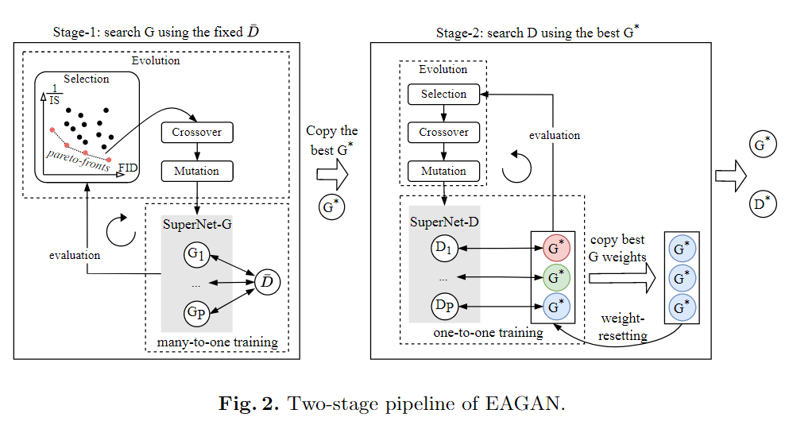

<div align="center">

<h1>(ECCV2022) EAGAN: Efficient Two-stage Evolutionary Architecture Search for GANs</h1>

<div>
    <a href='https://marsggbo.github.io/' target='_blank'>He Xin</a>, Guohao Ying, Bin Gao, Bo Han, and Xiaowen Chu.
</div>

</div>

## Introduction
This is the official implementation of *EAGAN: Efficient Two-stage Evolutionary Architecture Search for GANs*. We introduce a novel NAS framework, namely **EAGAN**, to alleviate the instability when searching GANs. Our EAGAN decouples the search into two stages, where stage-1 searches G with a fixed D and adopts the many-to-one training strategy, and stage-2 searches D with the optimal G found in stage-1 and adopts the one-to-one training strategy and the weight-resetting strategy to enhance the stability of GAN training.


The framework of the proposed method:

<div align="center">

</div>


## Installation

### Download
```
git clone https://github.com/marsggbo/EAGAN
cd EAGAN
```


### Environment
We recommend using Anaconda to manage the python environment:
```
conda create -n EAGAN python=3.8
conda activate EAGAN
pip install -r requirements.txt
```

## Searching


## Training


## Citation
If you find this work useful for your research, please kindly cite our paper:
```
@inproceedings{ECCV2022EAGAN,
  title={EAGAN: Efficient Two-stage Evolutionary Architecture Search for GANs},
  author={Xin He, Guohao Ying, Bin Gao, Bo Han, and Xiaowen Chu.},
  booktitle={European Conference on Computer Vision (ECCV)},
  year={2022}
}
```

## Acknowledgements

Thanks NVIDIA AI TECHNOLOGY CENTER (NVAITC) for providing GPU clusters to support our work.

[//]: <## Acknowledgements>
